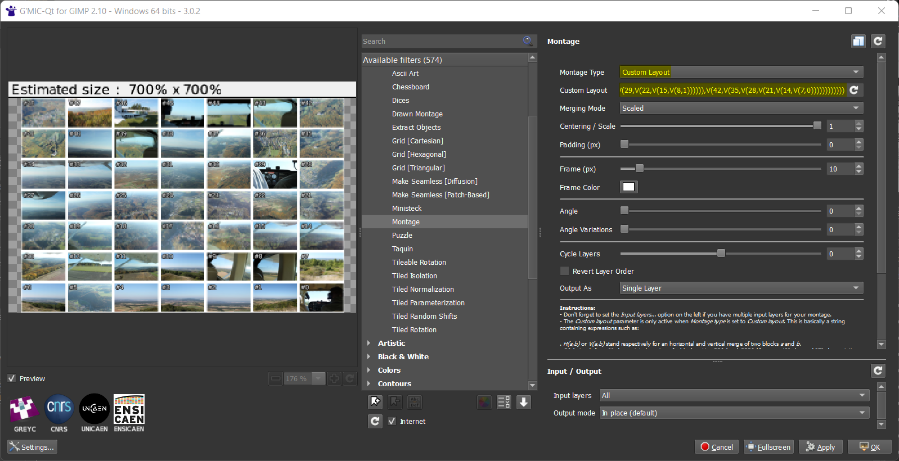

# G'MIC Collage Helper

This tool helps to create montages with a Custom Layout in [G'MIC](https://gmic.eu/). The script assembles a string that prompts G'MIC to arrange images in a grid. It may be useful for designing simple collages.

**Input Arguments**
- horizontal: number of images along the horizontal axis
- vertical: number of images along the vertical axis

